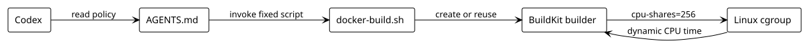

# BuildKit CPU Sharing Strategy

This repository keeps Docker builds simple: Codex must use one fixed shell script, and the script sets up a single BuildKit builder with a low CPU share.

## Flow



## Behavior

- `AGENTS.md` tells Codex to use `./scripts/docker-build.sh` for image builds.
- `docker-build.sh` creates or reuses the `elastic-builder` builder.
- `cpu-shares=256` is fixed at builder creation time.
- Linux cgroups decide the actual CPU time BuildKit gets under load.

The important distinction is:

- `cpu-shares`: fixed
- actual CPU allocation: dynamic

## Usage

```bash
./scripts/docker-build.sh app:latest
```

You can override the builder name or share value with environment variables:

```bash
BUILDER_NAME=my-builder CPU_SHARES=128 ./scripts/docker-build.sh app:latest
```

